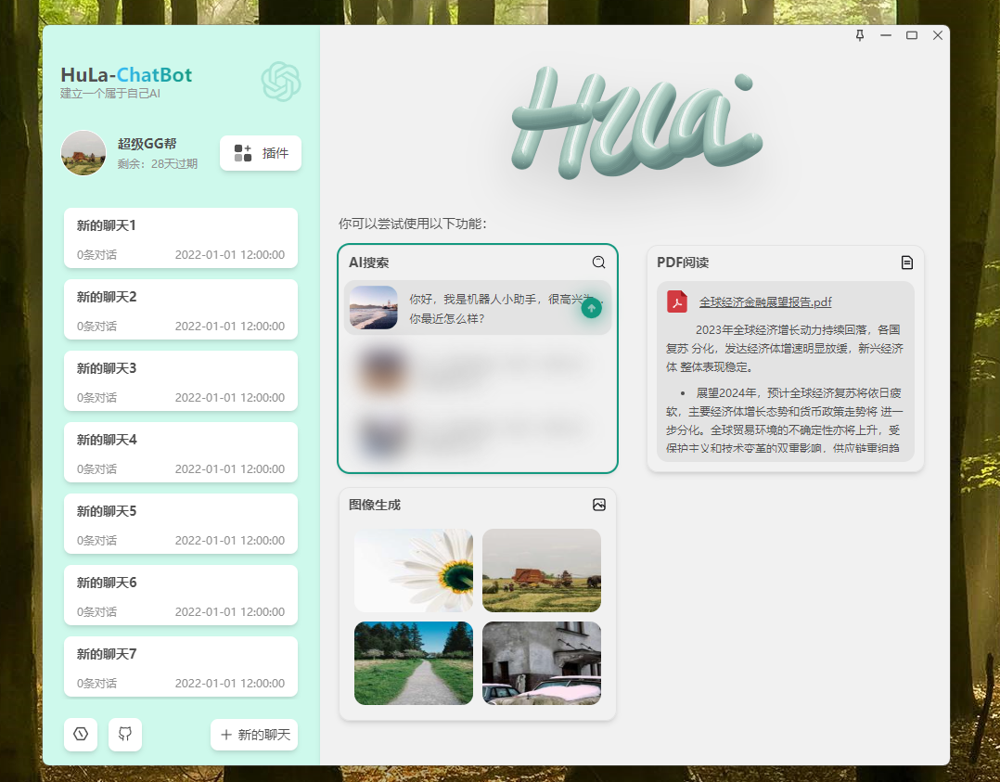

  

An instant messaging system server built with SpringBoot3, Netty, MyBatis-Plus and RocketMQ

  
  
  
  
  
  
  
  
  

  gitee：
  github：
  gitcode：

  WeChat: 

  🖥️ Client：<a href="https://github.com/HulaSpark/HuLa">github HuLa</a> | <a href="https://gitee.com/HulaSpark/HuLa">gitee HuLa</a>

English | <a href="README.md">中文</a>

## Project Introduction

HuLa-Server is an instant messaging system server built with SpringBoot3, Netty, MyBatis-Plus and RocketMQ. It adopts a microservice architecture design, providing high-performance real-time communication capabilities, supporting core features such as private chat, group chat, and message push. The system has high scalability and reliability, suitable for various instant messaging scenarios.

## Technology Stack

- **SpringBoot 3**: The latest version of the Spring Boot framework, providing a more modern Java development experience, supporting GraalVM native images, using Jakarta EE API, with better performance and lower memory consumption.

- **Netty**: A high-performance asynchronous event-driven network application framework, used to implement WebSocket long connection services, ensuring message real-time and reliability. Netty's high concurrent processing capability and excellent network programming model enable the system to support a large number of simultaneous online clients.

- **MyBatis-Plus**: Provides powerful enhancement functions and plugins for MyBatis, simplifies database operations, provides code generator, pagination plugin, performance analysis, and other features, greatly improving development efficiency.

- **RocketMQ**: A distributed message middleware, used for handling asynchronous communication between systems, supporting reliable message delivery, sequential messages, transaction messages, and other features, ensuring system scalability and decoupling.

- **Redis**: A high-performance in-memory database, used to store user session information, message cache, and other data, providing high-speed data access capabilities.

- **MySQL**: A reliable relational database, used to store user information, message records, and other persistent data.

- **WebSocket**: Implements full-duplex communication between client and server, supporting real-time message push.

## Client Preview

  

  

  

  

  

## Core Features

- Instant Messaging: Supports basic communication functions such as private chat, group chat, and message push
- Message Management: Supports message storage, history query, message recall, and other functions
- User System: Provides user registration, login, personal information management, and other functions
- Group Management: Supports group creation, member management, group announcements, and other functions
- Friend System: Supports friend adding, deletion, grouping, and other functions
- Message Notification: Supports offline messages, system notifications, and other functions
- Moments: Supports moments posting, liking, commenting, sharing, and other functions

Under continuous development...

## Thanks to all contributors!

## Disclaimer

1. This project is provided as an open-source project, and the developer does not provide any express or implied warranties for the functionality, security, or suitability of the software within the scope permitted by law
2. Users expressly understand and agree that the use of this software is entirely at their own risk, and the software is provided on an "as is" and "as available" basis. The developer provides no warranties of any kind, whether express or implied, including but not limited to warranties of merchantability, fitness for a particular purpose, and non-infringement
3. In no event shall the developer or its suppliers be liable for any direct, indirect, incidental, special, punitive, or consequential damages, including but not limited to loss of profits, business interruption, personal information leakage, or other commercial damages or losses arising from the use of this software
4. All users who conduct secondary development on this project must commit to using this software for legal purposes and are responsible for complying with local laws and regulations
5. The developer reserves the right to modify the software's features or characteristics, as well as any part of this disclaimer at any time, and these modifications may be reflected in software updates

**The final interpretation right of this disclaimer belongs to the developer**

## Sponsor HuLa
If you find HuLa helpful, welcome to sponsor HuLa. Your support is our motivation to keep moving forward

## HuLa Community Discussion Group

## Sponsor List
Thanks to the following sponsors for their support!

### 🔐 User Authentication System
| Feature | Description | Status |
|---------|-------------|--------|
| 🔑 | Username/Password Login |  |
| 📱 | QR Code Scan Login |  |
| 💻 | Multi-device Login Management |  |

### 💬 Message Communication
| Feature | Description | Status |
|---------|-------------|--------|
| 👤 | One-on-one Private Chat |  |
| 👥 | Group Chat |  |
| ↩️ | Message Recall |  |
| 📢 | @Mention & Reply Features |  |
| 👁️ | Message Read Status |  |
| 😊 | Emoji Features |  |
| 🖱️ | Message Right-click Menu |  |
| 🔗 | Link Preview Cards |  |
| 👍 | Message Like Interaction |  |
| 📔 | Chat History Management |  |

### 🤝 Social Management
| Feature | Description | Status |
|---------|-------------|--------|
| ➕ | Add & Remove Friends |  |
| 🔍 | Friend Search |  |
| 🏢 | Group Creation & Management |  |
| 🟢 | Friend Online Status |  |
| 🎖️ | Friend Badge System |  |
| 🚫 | Block & Do Not Disturb |  |
| 📤 | Message Forwarding |  |
| 📋 | Group Announcements |  |
| 🏷️ | Nickname & Remark Management |  |
| üìç | Get and Send Location |  |

### 🎨 User Experience
| Feature | Description | Status |
|---------|-------------|--------|
| 🖼️ | Modern UI Design |  |
| 🌙 | Dark & Light Theme |  |
| 🎭 | Skin Theme Switching |  |

### 🛠️ System Features
| Feature | Description | Status |
|---------|-------------|--------|
| 🪟 | Multi-window Management |  |
| 🔔 | System Tray Notifications |  |
| 📷 | Image Viewer |  |
| ✂️ | Screenshot Feature |  |
| 📁 | File Upload (Qiniu Cloud) |  |
| 🔄 | Auto-update System |  |

### 🌐 Cross-platform Support
| Feature | Description | Status |
|---------|-------------|--------|
| 💻 | Windows/macOS/Linux |  |
| 📱 | iOS/Android Adaptation |  |

### 🤖 AI Integration
| Feature | Description | Status |
|---------|-------------|--------|
| 🧠 | AI Chat Assistant |  |
| üîå | Multi-platform AI Support |  |

## 👏 Thanks to all Contributors!

> Note: This list is manually updated. If you have sponsored but are not shown in the list, please contact us through:
 1. Submit an Issue on GitHub
 2. Send an email to: 2439646234@qq.com
 3. Contact via WeChat: cy2439646234
