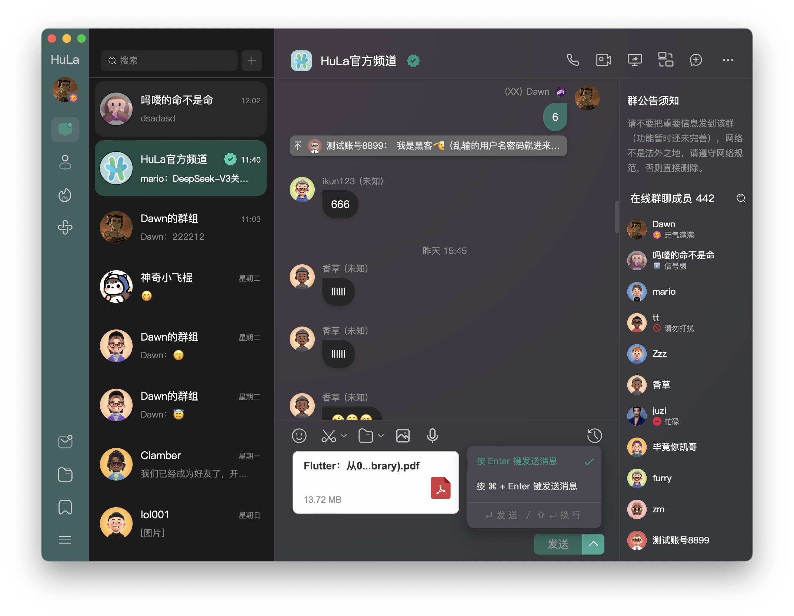
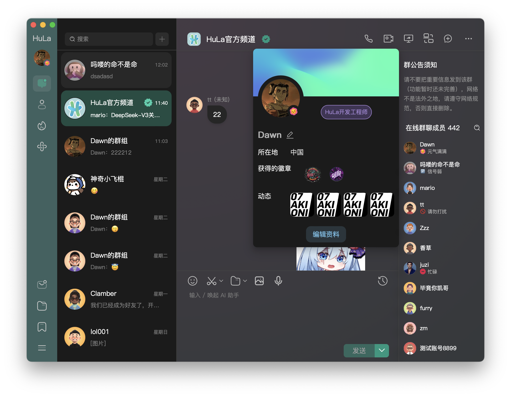
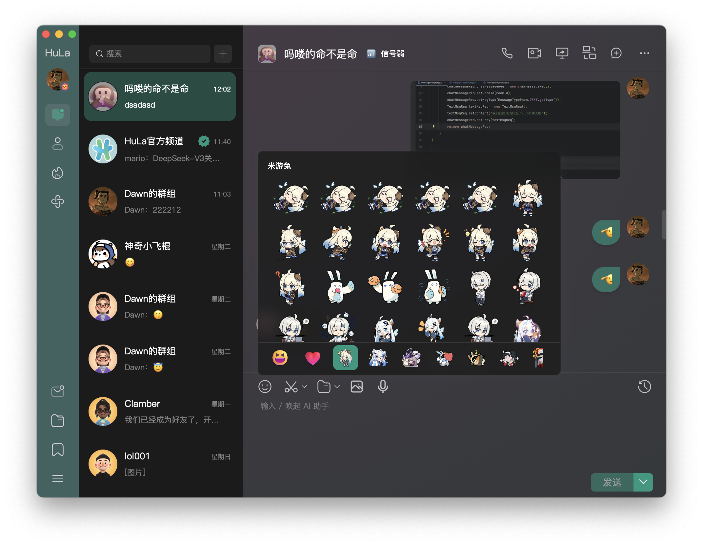
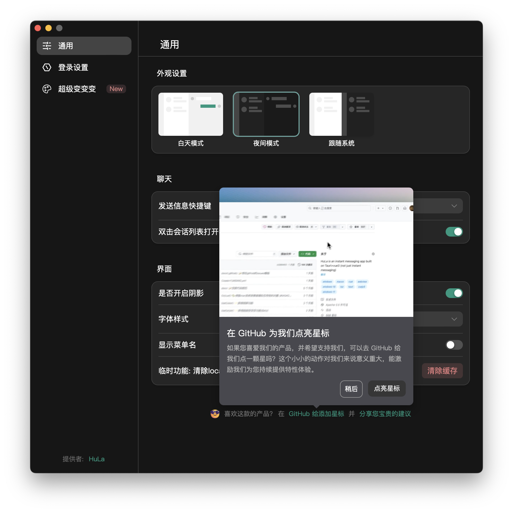
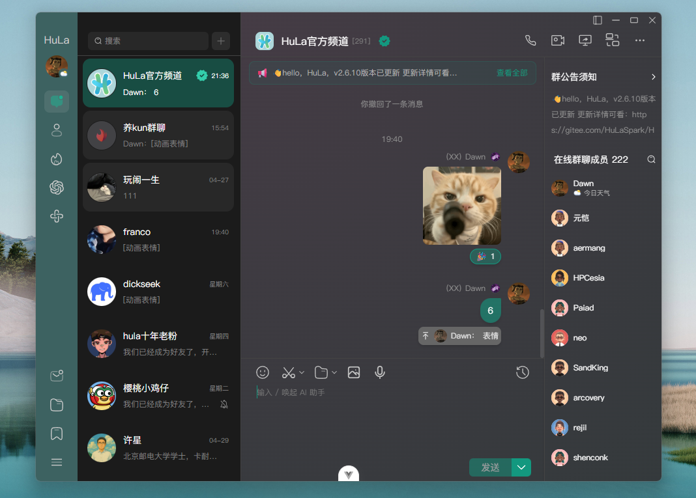
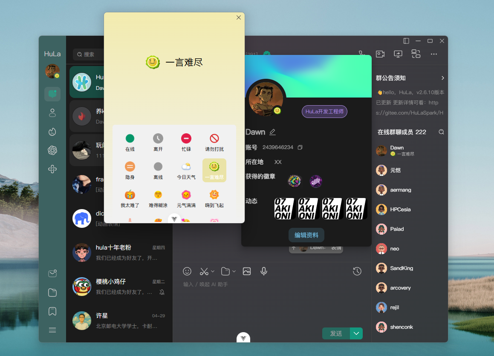
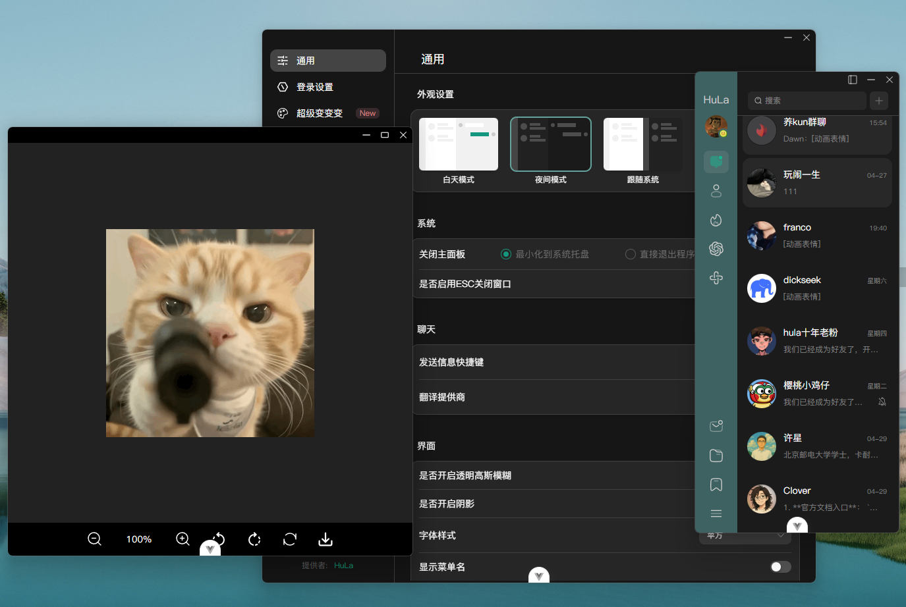
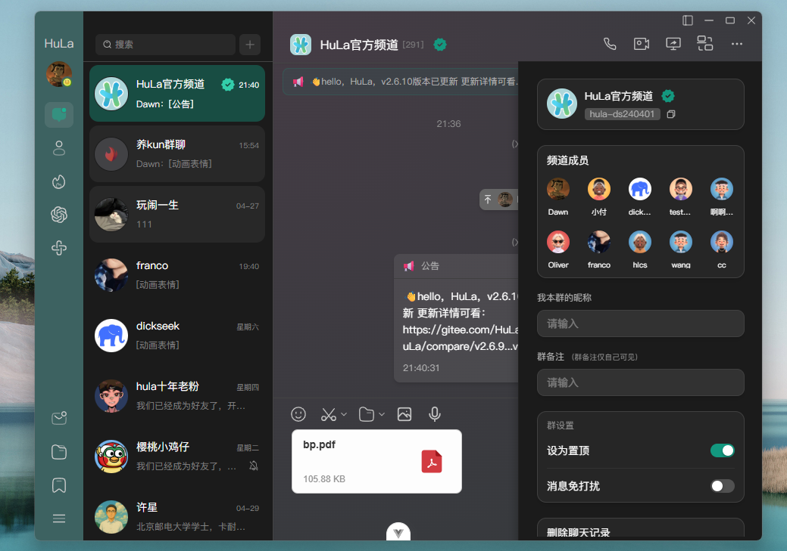
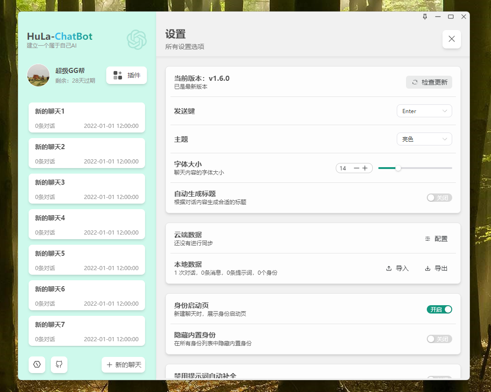
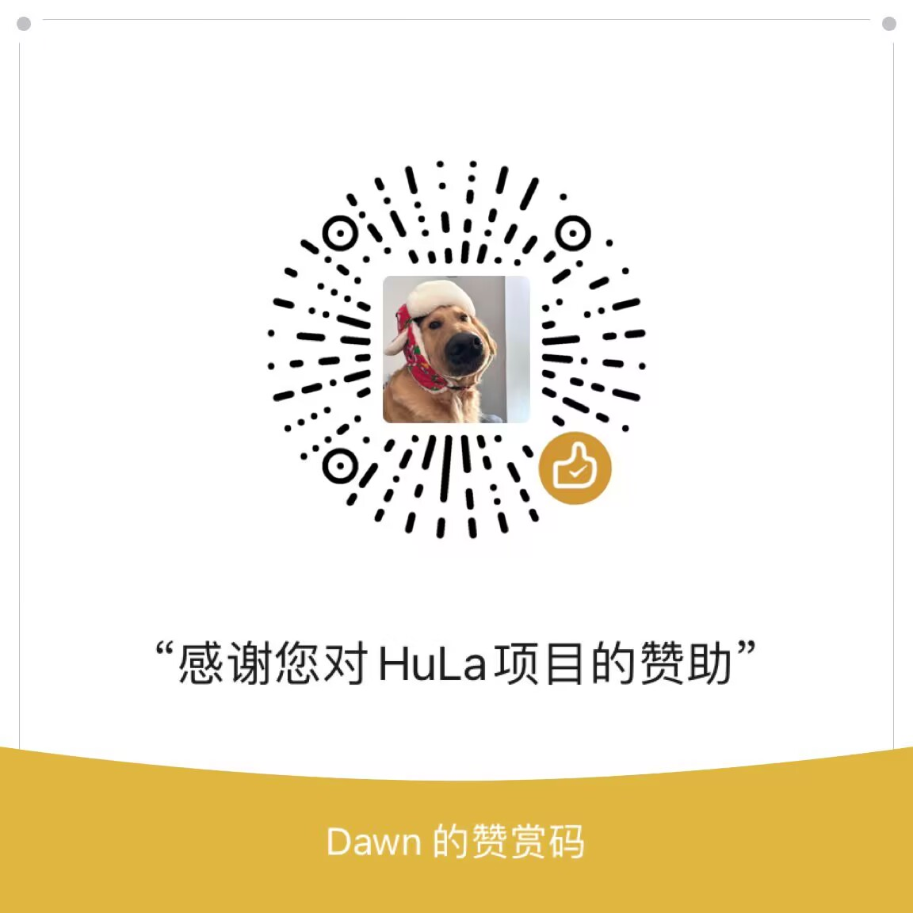

  

一款基于SpringBoot3、Netty、MyBatis-Plus和RocketMQ构建的即时通讯系统服务端

  
  
  
  
  
  
  
  
  

  gitee：
  github：
  gitcode：

  微信: 

  🖥️ 客户端：<a href="https://github.com/HulaSpark/HuLa">github HuLa</a> | <a href="https://gitee.com/HulaSpark/HuLa">gitee HuLa</a>

<a href="README.en.md">English</a> | 中文

## 项目介绍

HuLa-Server 是一款基于 SpringBoot3、Netty、MyBatis-Plus 和 RocketMQ 构建的即时通讯系统服务端。它采用了微服务架构设计，提供高性能的实时通信能力，支持单聊、群聊、消息推送等核心功能。系统具有高可扩展性和可靠性，适用于各类即时通讯场景。

## 技术栈

- **SpringBoot 3**: 最新版本的Spring Boot框架，提供了更现代化的Java开发体验，支持GraalVM原生镜像，采用Jakarta EE API，具有更好的性能和更低的内存占用。

- **Netty**: 高性能的异步事件驱动网络应用框架，用于实现WebSocket长连接服务，保证消息的实时性和可靠性。Netty的高并发处理能力和优秀的网络编程模型，使得系统能够支持大量客户端的同时在线。

- **MyBatis-Plus**: 为MyBatis提供了强大的增强功能和插件，简化了数据库操作，提供了代码生成器、分页插件、性能分析等功能，大大提高了开发效率。

- **RocketMQ**: 分布式消息中间件，用于处理系统间的异步通信，支持消息的可靠传递、顺序消息、事务消息等特性，保证了系统的可扩展性和解耦性。

- **Redis**: 高性能的内存数据库，用于存储用户会话信息、消息缓存等数据，提供了高速的数据访问能力。

- **MySQL**: 可靠的关系型数据库，用于存储用户信息、消息记录等持久化数据。

- **WebSocket**: 实现了客户端与服务器之间的全双工通信，支持实时消息推送。

## 客户端预览

  

  

  

  

  

## 核心功能

- 即时通讯：支持单聊、群聊、消息推送等基础通讯功能
- 消息管理：支持消息存储、历史记录查询、消息撤回等功能
- 用户系统：提供用户注册、登录、个人信息管理等功能
- 群组管理：支持群组创建、成员管理、群公告等功能
- 好友系统：支持好友添加、删除、分组等功能
- 消息通知：支持离线消息、系统通知等功能
- 朋友圈：支持朋友圈发布、点赞、评论、转发等功能

持续开发中...

## 感谢以下贡献者们！

## 免责声明

1. 本项目是作为一款开源项目提供的，开发者在法律允许的范围内不对软件的功能性、安全性或适用性提供任何形式的明示或暗示的保证
2. 用户明确理解并同意，使用本软件的风险完全由用户自己承担，软件以"现状"和"现有"基础提供。开发者不提供任何形式的担保，无论是明示还是暗示的，包括但不限于适销性、特定用途的适用性和非侵权的担保
3. 在任何情况下，开发者或其供应商都不对任何直接的、间接的、偶然的、特殊的、惩罚性的或后果性的损害承担责任，包括但不限于使用本软件产生的利润损失、业务中断、个人信息泄露或其他商业损害或损失
4. 所有在本项目上进行二次开发的用户，都需承诺将本软件用于合法目的，并自行负责遵守当地的法律和法规
5. 开发者有权在任何时间修改软件的功能或特性，以及本免责声明的任何部分，并且这些修改可能会以软件更新的形式体现

**本免责声明的最终解释权归开发者所有**

## 赞助HuLa
如果您觉得HuLa对您有帮助，欢迎赞助HuLa，您的支持是我们不断前进的动力

## HuLa社区讨论群

## 赞助者名单
感谢以下赞助者的支持！

| 日期 | 赞助者 | 金额 | 平台 |
|------|--------|------|------|
| 2025-02-17 | 禾硕 | ￥168 | 支付宝赞赏 |
| 2025-02-8 | Boom.... | ￥100 | 微信赞赏码 |
| 2025-02-8 | 邓伟 | ￥88 | 微信赞赏码 |
| 2025-02-7 | dennis | ￥80 | gitee码云赞赏 |
| 2025-02-6 | 小二 | ￥62 | 微信转账 |

> 注：该名单为手动更新。如果您已赞助但未显示在列表中，请通过以下方式联系我们：
 1. 在GitHub上提交Issue
 2. 发送邮件至: 2439646234@qq.com
 3. 通过微信联系: cy2439646234
