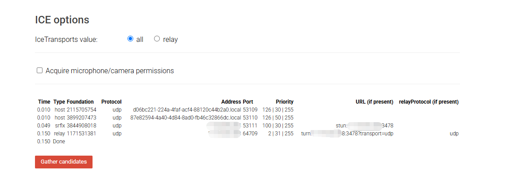

## 📝 root用户登录

### 1. 检查环境

```bash
# 检查 gcc

which gcc

# 安装 gcc

1.1.1 使用yum安装
yum -y install openssl-devel

1.1.2 生成签名 [一直回车就行]
openssl req -x509 -newkey rsa:2048 -keyout /etc/turn_server_pkey.pem -out /etc/turn_server_cert.pem -days 99999 -nodes

1.1.3 开放端口
3478/udp、3478/tcp
```

### 2. 安装libevent

```bash
# 解压

tar -zxvf libevent-2.1.12-stable.tar.gz

# 安装 libevent

cd libevent-2.1.12-stable/
./configure
make
make install

```


### 3. 安装coturn

```bash
# 解压

tar -zxvf coturn-4.5.1.1.tar.gz

# 安装 coturn

cd coturn-4.5.1.1
./configure
make
make install

```

### 3. 生成用户

```bash
# 生成

turnadmin -a -u chr -p 11111 -r hulaspark.com
```

### 4. 创建 [turnserver.conf](turn/turnserver.conf) 配置文件

```bash
# 创建文件

vi /usr/local/etc/turnserver.conf
```

### 5. 启动服务

```bash
# 执行命令

turnserver -a -o -f -r hulaspark.com
```

### 6. 测试服务

https://webrtc.github.io/samples/src/content/peerconnection/trickle-ice/

