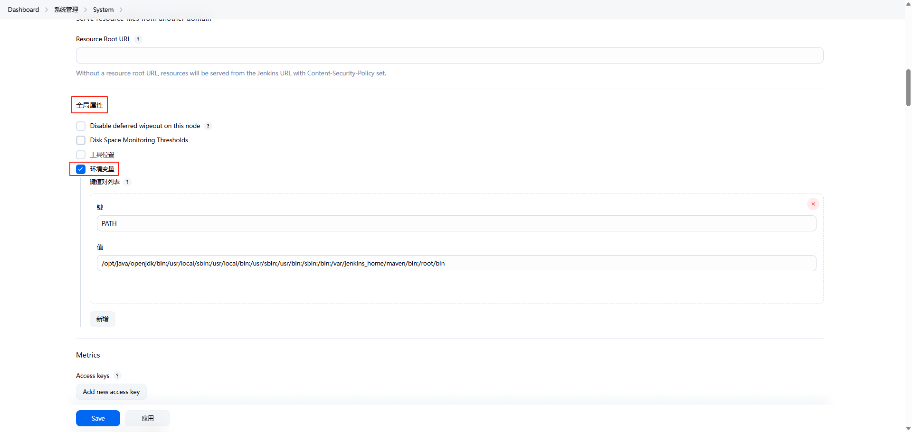
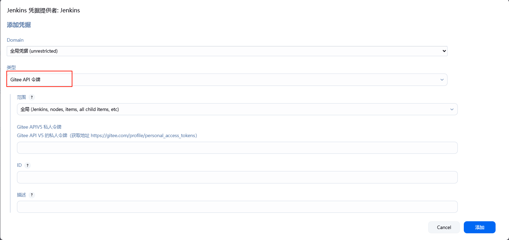
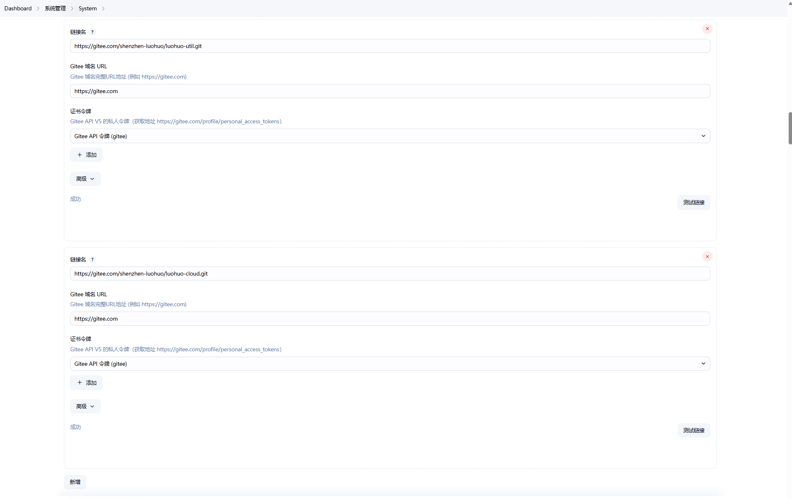
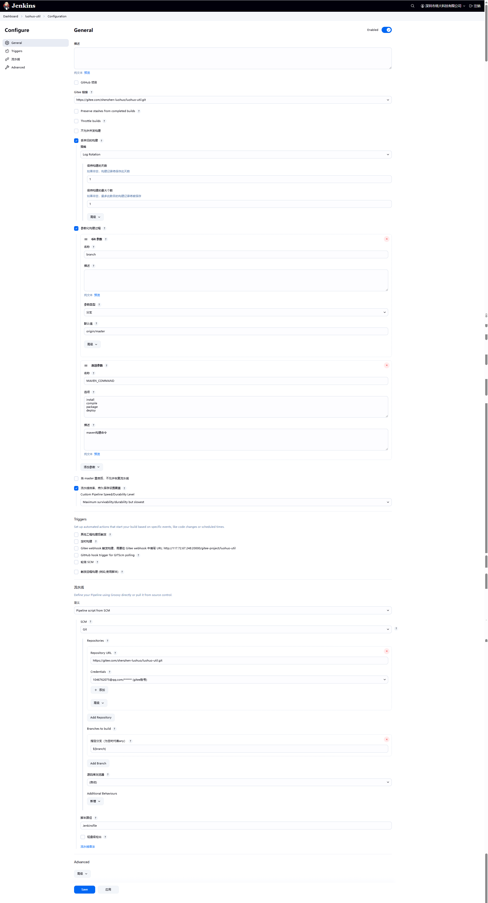
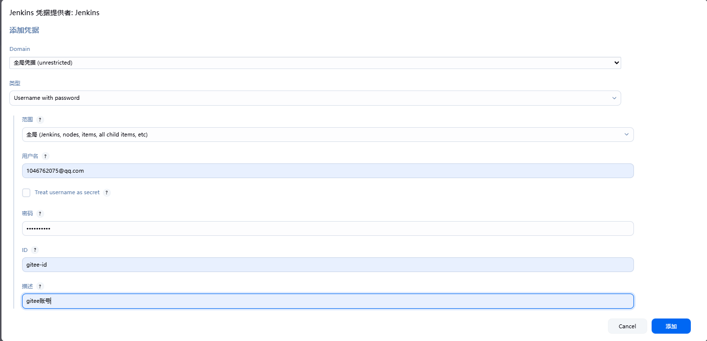
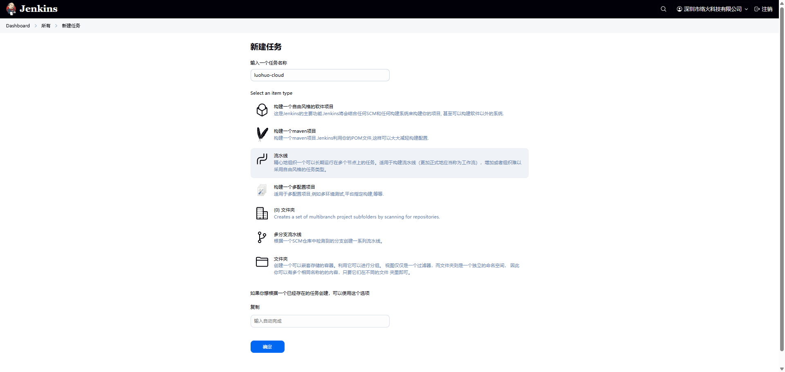
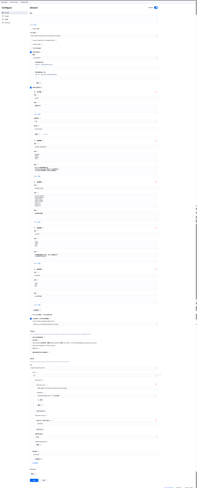
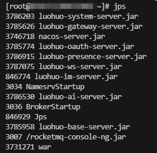

## 📝 修改环境配置

上传 `install/docker` 目录到服务器 `/home/docker` 下，需要修改 `.env`、RocketMQ 配置等文件，特别是 [broker.conf](docker/rocketmq/broker/conf/broker.conf) 里面 `brokerIP1` 的值。


`docker-compose.yml` 面向 Linux 服务器，挂载目录统一使用相对路径 `./...`，不要写 `E:/...` 这类 Windows 盘符。在 `/home/docker` 执行时，数据会落到 `/home/docker/mysql/data`、`/home/docker/nacos/logs`、`/home/docker/minio/data` 等目录。首次部署前可以先创建目录：

```bash
cd /home/docker
mkdir -p nacos/logs mysql/data redis/data redis/logs minio/data minio/config rocketmq/namesrv/logs rocketmq/namesrv/store rocketmq/broker/logs rocketmq/broker/store rocketmq/timerwheel
```

Nacos 3.x 控制台默认端口是 `8080`，服务端客户端连接端口仍然是 `8848`。应用连接 Nacos 用的是 `8848`，浏览器打开 Nacos 控制台用的是 `8080`。

## 📝 Nacos 配置和命名空间 ID

服务端部署默认使用 `prod` 环境，Maven 会读取 `src/main/filters/config-prod.properties`，并把里面的值过滤到各服务的 `target/classes/bootstrap.yml`。

生产环境需要重点确认这些值：

```properties
nacos.ip=服务器或容器可访问的 Nacos 地址
nacos.port=8848
nacos.namespace=生产环境 Nacos namespace id
nacos.username=nacos
nacos.password=你的 Nacos 密码
nacos.web-port=8080
nacos.local-ip=当前服务注册到 Nacos 的 IP
database.type=mysql.yml
```

修改 Nacos 命名空间 ID 的推荐方式：

1. 在 Nacos 控制台创建或导入生产命名空间，复制 namespace id。
2. 修改 `src/main/filters/config-prod.properties` 的 `nacos.namespace`。
3. 确认该命名空间里有服务需要的 DataId：`common.yml`、`redis.yml`、`mysql.yml`、`rocketmq.yml`、以及每个服务自己的 `luohuo-xxx-server.yml`。
4. 重新执行 `mvn -Pprod -DskipTests install` 或 Jenkins 的 cloud install 流水线。
5. 重启服务。

如果不想重新打包，也可以在启动进程前用环境变量覆盖，环境变量优先级高于打包时写入的默认值：

```bash
export NACOS_IP=127.0.0.1
export NACOS_PORT=8848
export NACOS_NAMESPACE=生产环境 Nacos namespace id
export NACOS_USERNAME=nacos
export NACOS_PASSWORD=你的 Nacos 密码
export NACOS_WEB_PORT=8080
export NACOS_LOCAL_IP=当前服务注册到 Nacos 的 IP
```

当前 `src/main/bin/run.sh` 只固定传了 `-Dspring.profiles.active=prod`，没有硬编码 Redis、MySQL、RocketMQ。Redis、MySQL、RocketMQ 的真实连接信息都从 Nacos 配置读取。

Spring Boot 4 / Spring Cloud Alibaba 2025 使用 `spring.config.import` 加载 Nacos，不再使用旧版 `shared-configs`。普通服务会按下面顺序加载：

```yaml
nacos:common.yml
nacos:redis.yml
nacos:@database.type@
nacos:rocketmq.yml
nacos:@project.artifactId@.yml
```

例如 `luohuo-base-server` 在 `prod` 打包后会加载：`common.yml`、`redis.yml`、`mysql.yml`、`rocketmq.yml`、`luohuo-base-server.yml`。

注意：`luohuo-gateway-server.yml` 在 Spring Cloud Gateway 5.x 下必须使用 `spring.cloud.gateway.server.webflux` 前缀，旧 `spring.cloud.gateway` 前缀不会再生效。
`luohuo-gateway-server.yml` 的路由保持 `/oauth/**`、`/system/**`、`/ws/**` 等业务前缀，配套 `StripPrefix=1`；本地或单机前端地址指向 `http://服务器IP:18760`，不要额外加 `/api`。生产如果由域名统一暴露 `/api`，用 Nginx 或 Gateway 的 `server.servlet.context-path: /api` 处理外部前缀，Nacos 路由仍不写 `/api`。

`luohuo-support/luohuo-boot-server` 是单体启动模块，读取的是模块内置的 `config/prod/*.yml`。如果生产或测试库仍然拆成 `luohuo_dev` 和 `luohuo_im_01`，保持 `luohuo_dev` 作为主库，并用环境变量 `IM_SCHEMA=luohuo_im_01` 指定 IM 表所在 schema；这个配置只在 BootServer 生效，不影响 cloud 微服务。


单机部署时也可以不启动 gateway、base、oauth、im、system、ws 等 cloud 微服务，直接运行 BootServer：

```bash
export SPRING_PROFILES_ACTIVE=prod
export IM_SCHEMA=luohuo_im_01
java -jar /home/jenkins/work/workspace/luohuo-cloud/luohuo-support/luohuo-boot-server/target/luohuo-boot-server-*.jar --spring.profiles.active=prod
```

这种方式只需要维护 BootServer 的 `config/prod/mysql.yml`、`redis.yml`、`rocketmq.yml`、`oss.yml` 等本地配置；前端后端地址指向 `http://服务器IP:18760`，WebSocket 指向 `ws://服务器IP:18760/ws/ws`。

## 🛠️ 注册时需要的邮箱功能

- **配置邮箱密钥**: 

## 🛠️ 启动命令

- **提高权限**: `sudo chmod -R 777 /home/docker/rocketmq`
- **开放端口**: 先去服务器平台安全组放行 MySQL、Redis、RocketMQ、Nacos 等端口，再去 1Panel 或宝塔里面放行。
- **执行命令**: `cd /home/docker && docker-compose up -d`
- **导入 Nacos 数据库**: `install` 文件夹下面有一个 Nacos [mysql-schema.sql](mysql-schema.sql)，需要导入到数据库里，不然 Nacos 启动不了。
- **重试 Nacos**: 如果还不行，删掉 Nacos 容器后重新执行 `docker-compose up -d`。

## 🖼️ 效果预览


## 🛠️ 安装项目环境

- **开放端口**: 安全组里面放行 Jenkins 部署端口，再去 1Panel 或宝塔下面放行，我这里配置的是 `20000`。
- **安装 JDK 25**: 服务端和本地开发保持一致，当前项目按 Java 25 编译运行。
- **安装 Git、Maven**: Git 可用系统自带，Maven 从 https://maven.apache.org/download.cgi 下载后上传解压即可，安装在宿主机。

## 🛠️ Jenkins 环境配置

- **查看密码**: `docker logs -f jenkins | grep "initialAdminPassword"`
  
- **进入 Jenkins**: `http://ip:20000`，输入上一步查看得到的密码，配置各项基础信息。
- **安装插件**: 自行选择默认推荐的就行，Ant、Gradle 等一些没用的插件可以取消勾选。
- **下载必选 Jenkins 插件**: `http://ip:20000/manage/pluginManager/`
   ```
   Git Parameter
   Git plugin
   Maven Integration
   gitee
   Publish Over SSH
   ```
- **系统全局配置**: `http://ip:20000/manage/configure` 配置环境变量。
   ```
   PATH
   /opt/java/openjdk/bin:/usr/local/sbin:/usr/local/bin:/usr/sbin:/usr/bin:/sbin:/bin:/var/jenkins_home/maven/bin:/root/bin
   ```

- **系统全局配置**: `http://ip:20000/manage/configure` 配置项目地址；添加凭证时必须选 giteeAPI，util、cloud 两个项目地址都需要配进去，点击测试链接按钮必须返回成功。
  
  

- **系统全局配置**: `http://ip:20000/manage/configureTools/` 配置 Jenkins 内部 Maven；项目环境中下载的 Maven 解压到 `/home/jenkins/work` 下面。
  
  

## 🛠️ 创建 util、cloud 项目流水线

- **创建 util**: 输入名称、选择流水线。
  
- **配置 util**: 根据步骤仔细对比上面的内容。
  
- **创建账号凭证**: 这一步创建的账号是 username，注意是你登录 gitee 的账号密码，不是 apikey。
  

- **创建 cloud**: 输入名称、选择流水线。
  
- **配置 cloud**: 根据步骤仔细对比上面的内容。
  

## 🛠️ 编译 util、cloud

- **install util**: 因为 cloud 依赖 util，所以先安装 util 到 Maven 本地仓库。
  

- **install cloud**: 必须等 util 模块 install 完成才行，这样 cloud 模块就可以通过 Maven 本地仓库找到 util 依赖。
  

## 🛠️ 运行项目

- **开放端口**: `10911` 是 RocketMQ 通信用的。
- **授权目录**:
```
chmod 777 /home/docker/rocketmq/broker/logs
chmod 777 /home/docker/rocketmq/broker/store
chmod 777 /home/docker/rocketmq/namesrv/logs
chmod 777 /home/docker/rocketmq/namesrv/store
```
- **导入数据库**: `luohuo_im_01`、`luohuo_dev`。
- **确认 Nacos 配置**: Docker 或服务器部署时，Nacos 中的 MySQL、Redis、RocketMQ 地址不要写 `127.0.0.1`，要写应用服务能访问到的宿主机 IP、容器网络地址或内网地址。
- **执行命令**: `/bin/bash /home/jenkins/work/workspace/luohuo-cloud/src/main/bin/all-start.sh`



- **注意事项**: 消息推送采用 CLUSTERING 模式，单个 MQ 只能被一个 cloud 项目连接，多个 cloud 可能会导致消息接收不到；若需要多次连接，必须 Docker 再开一个 RocketMQ 的 test 版本单独连接，直接复制 [rocketmqtest](rocketmqtest) 目录后 `docker-compose up -d` 即可。

## 🛠️ 本地视频语音电话

- **浏览器输入地址**: `chrome://flags/`
- **搜索关键字**: `Insecure origins treated as secure`
- **开放端口和 IP**: `http://192.168.1.37:6130,http://192.168.1.24:6130,http://192.168.1.26:6130`
