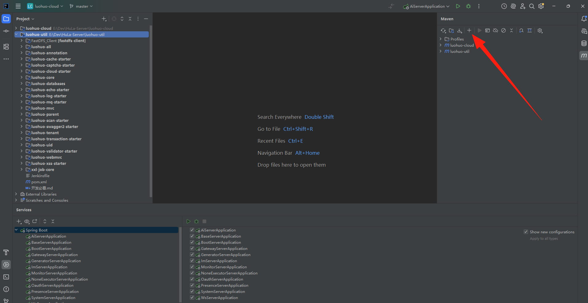
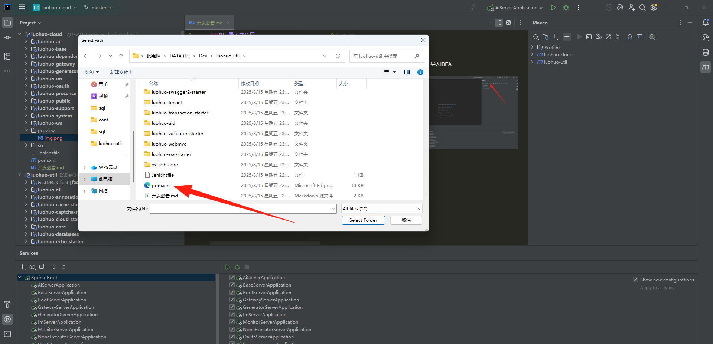
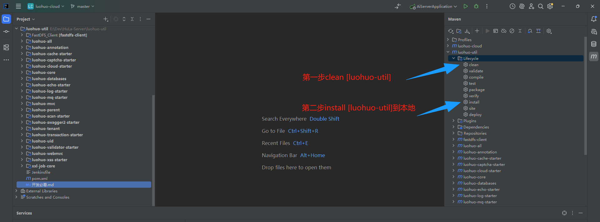
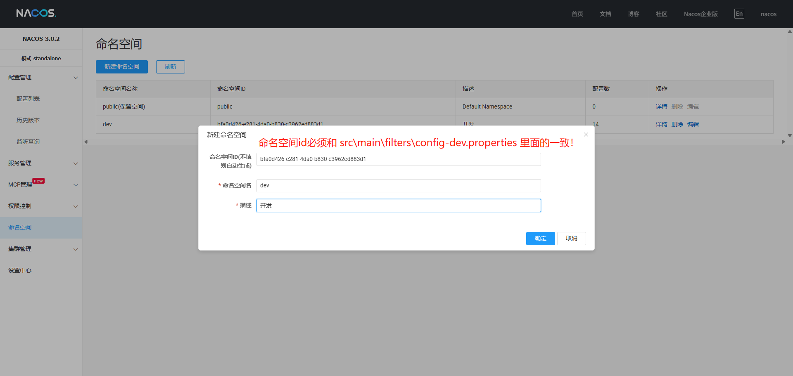
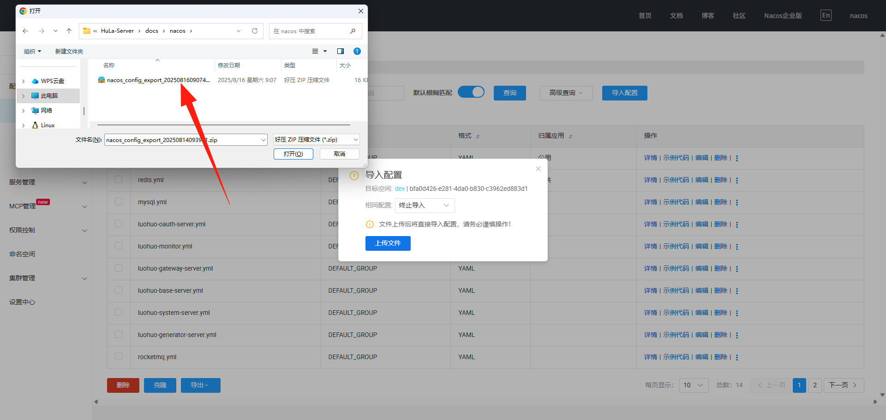
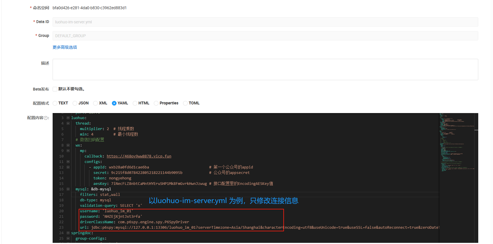
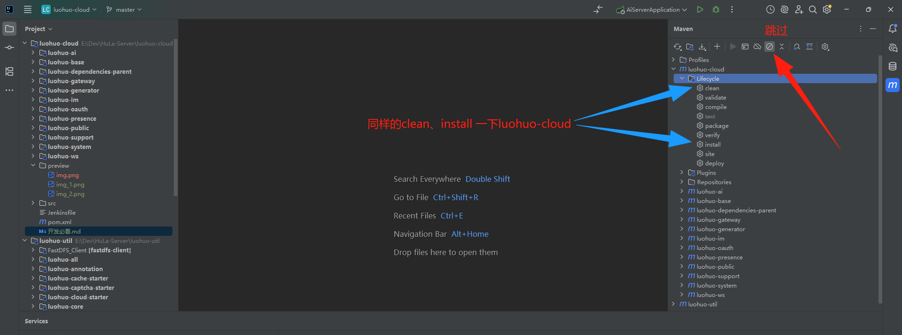
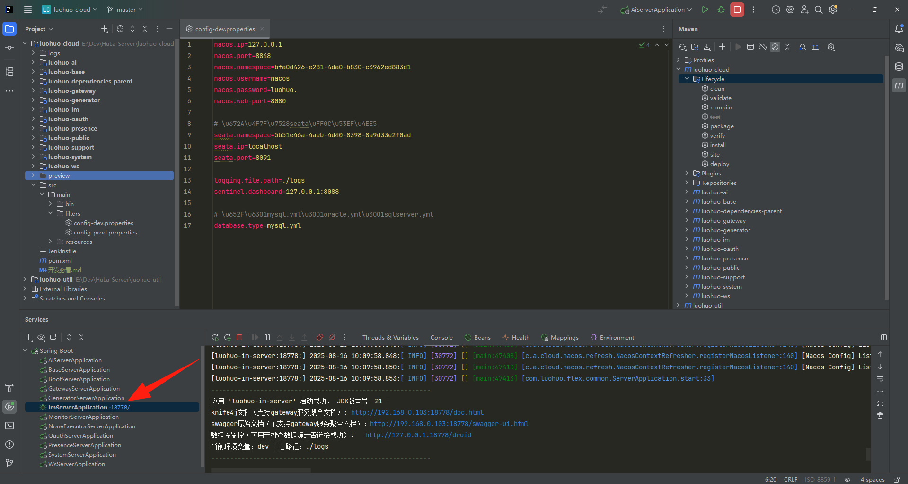

## 本地如何跑hula 

注意！！ 开发环境默认大家已经安装nacos（版本我用的是3.0.2，web端端口是8080，老版本是8848）、rocketMQ、mysql、redis这些组件了
如果没有的话先看一下 [redis、mysql、rocketmq、nacos一键部署.md](install/docker/reids%E3%80%81mysql%E3%80%81rocketmq%E3%80%81nacos%E4%B8%80%E9%94%AE%E9%83%A8%E7%BD%B2.md) (组件部署文档)

下面执行顺序不能乱，因为install cloud模块的时候需要将 src/main/filters 里面的配置打到target里面去

1. 将 luohuo-cloud/pom.xml 导入IDEA
2. 导入luohuo-util项目

3. 安装luohuo-util到本地
4. 导入nacos环境，以我本地为例：127.0.0.1:8080
5. 修改redis.yml、mysql.yml、rocketmq.yml、luohuo-im-server.yml的配置
6. 安装luohuo-cloud到本地
7. 导入数据库 [luohuo_dev.sql](install/sql/luohuo_dev.sql)、[luohuo_im_01.sql](install/sql/luohuo_im_01.sql)
8. 运行效果图
9. 前端配置访问地址：
```bash
# src-tauri/configuration/local.yaml

database:
  sqlite_file: db.sqlite
backend:
  base_url: http://192.168.1.37:18760
  ws_url: ws://192.168.1.37:18760/ws/ws

youdao:
  app_key: ''
  app_secret: ''
tencent:
  api_key: ''
  secret_id: ''
  map_key: ''
```
