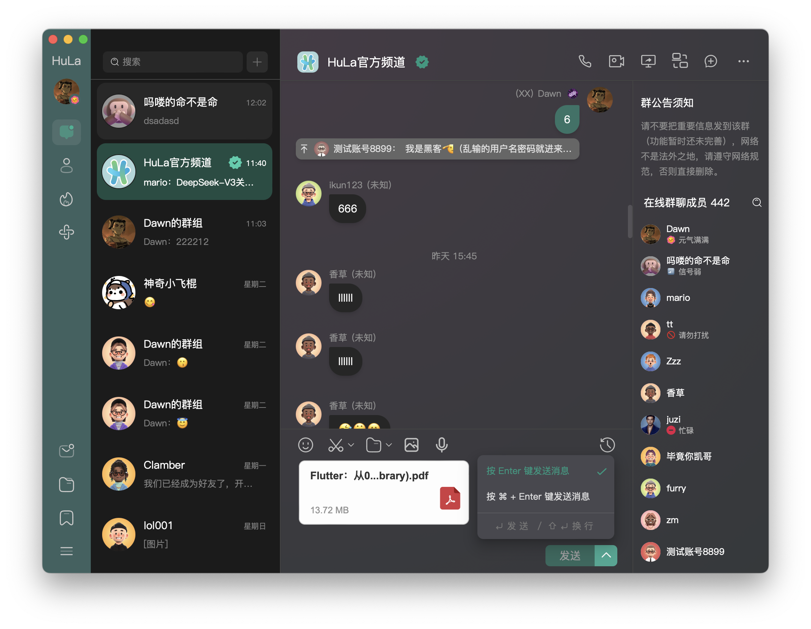
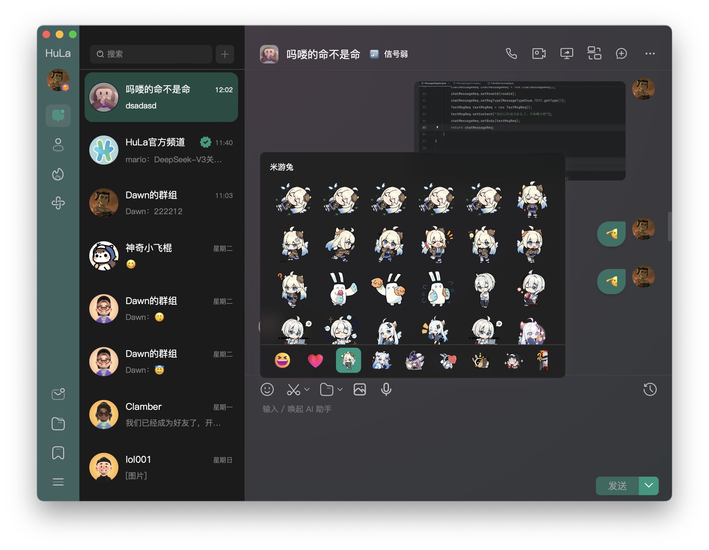
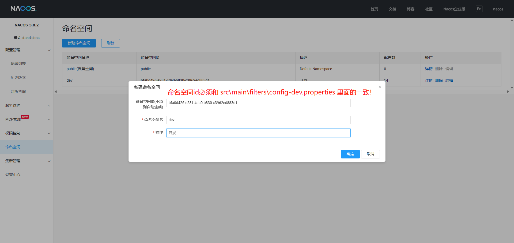
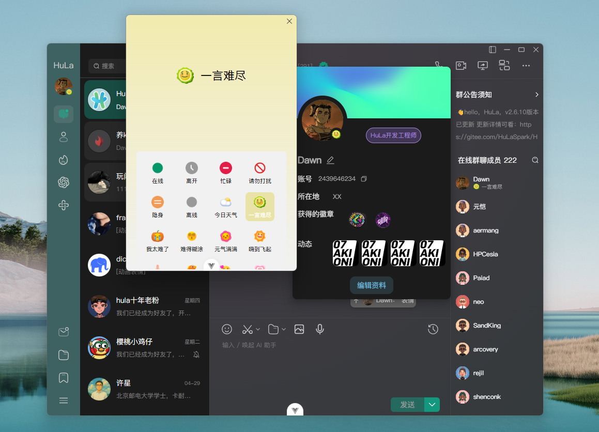
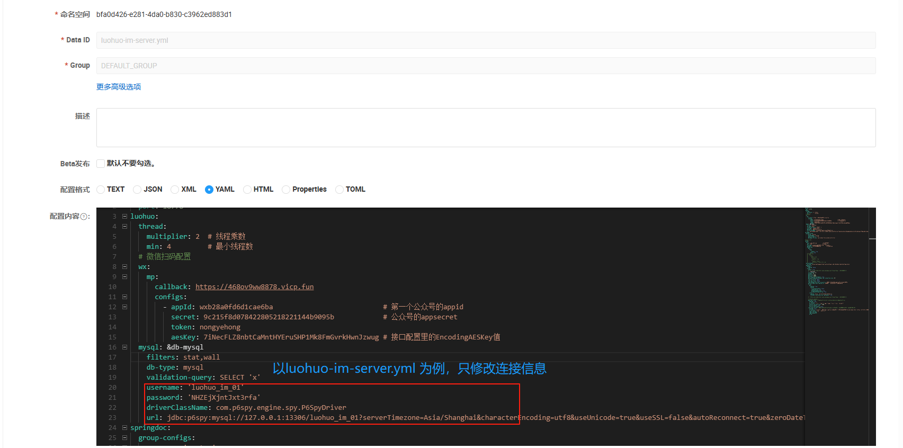
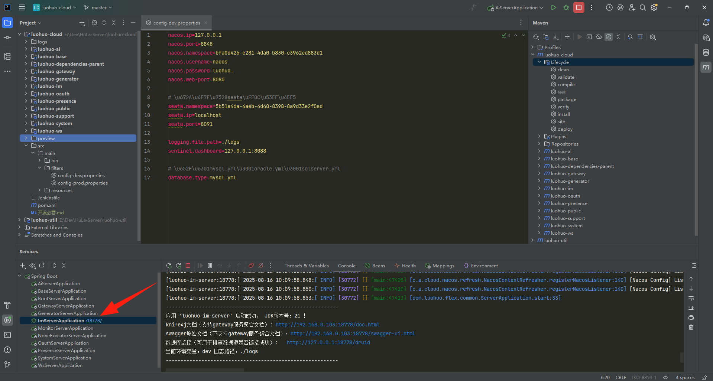

## 本地如何跑 hula

注意：开发环境默认已经安装 JDK 25、Maven、Nacos、RocketMQ、MySQL、Redis。当前推荐版本为 Nacos 3.1.x、RocketMQ 5.5.x；Nacos 3.x 控制台端口默认是 8080，客户端连接端口仍然是 8848。没有这些组件时，先看 [redis、mysql、rocketmq、nacos一键部署.md](install/docker/reids%E3%80%81mysql%E3%80%81rocketmq%E3%80%81nacos%E4%B8%80%E9%94%AE%E9%83%A8%E7%BD%B2.md)。

下面执行顺序不能乱，因为 install cloud 模块时会把 `src/main/filters` 里面的配置过滤到各模块的 `target/classes/bootstrap.yml`。

## Nacos 配置链路

Spring Boot 4 / Spring Cloud Alibaba 2025 使用 `spring.config.import` 加载 Nacos 配置，本项目不再使用旧版 `shared-configs`。服务启动时会按下面顺序从 Nacos 拉配置：

```yaml
nacos:common.yml
nacos:redis.yml
nacos:@database.type@
nacos:rocketmq.yml
nacos:@project.artifactId@.yml
```

说明：

- `@database.type@` 来自 `src/main/filters/config-dev.properties`，默认是 `mysql.yml`，可改为 `oracle.yml`、`sqlserver.yml`。
- `@project.artifactId@.yml` 会在 Maven 打包时变成当前服务自己的 DataId，例如 `luohuo-base-server.yml`、`luohuo-im-server.yml`。
- Redis、MySQL、RocketMQ 连接信息都放在 Nacos 里，不要再手动写到本地 `bootstrap.yml`。
- `luohuo-support/luohuo-monitor` 不连接 Redis 和数据库，只加载 `common.yml`、`rocketmq.yml`、`luohuo-monitor.yml`。
- `luohuo-support/luohuo-boot-server` 是单体启动模块，不走 cloud 服务的 Nacos 拆分数据库配置；如果 `im_*` 表在单独的 `luohuo_im_01` 库，使用 BootServer 自己的 `IM_SCHEMA` 覆盖即可，默认是 `luohuo_im_01`，不会影响 `luohuo-im-server` 等 cloud 服务。
- `luohuo-gateway-server.yml` 在 Spring Cloud Gateway 5.x 下必须使用 `spring.cloud.gateway.server.webflux` 前缀，旧 `spring.cloud.gateway` 前缀不会再生效。
- Gateway 的 Nacos 路由保持 `/oauth/**`、`/system/**`、`/ws/**` 等业务前缀，配套 `StripPrefix=1`；本地前端 `src-tauri/configuration/local.yaml` 的 `base_url` 指向 `http://本机IP:18760`，不要追加 `/api`。生产如果对外暴露 `/api`，由 Nginx 或 Gateway 的 `server.servlet.context-path: /api` 承担外部前缀。

## 如何修改 Nacos 命名空间 ID

本地开发默认读取 `src/main/filters/config-dev.properties`：

```properties
nacos.ip=127.0.0.1
nacos.port=8848
nacos.namespace=你的 Nacos namespace id
nacos.username=nacos
nacos.password=nacos
nacos.web-port=8080
nacos.local-ip=你的本机局域网 IP
database.type=mysql.yml
```

修改方式：

1. 在 Nacos 控制台创建或导入命名空间，复制命名空间 ID。
2. 修改 `src/main/filters/config-dev.properties` 的 `nacos.namespace`。
3. 确认该命名空间里至少有 `common.yml`、`redis.yml`、`mysql.yml`、`rocketmq.yml` 和对应服务的 `luohuo-xxx-server.yml`。
4. 重新执行 Maven install/package，让 `@nacos.namespace@`、`@database.type@` 等占位符重新过滤进 `target/classes/bootstrap.yml`。

也可以不改文件，直接用环境变量覆盖：

```bash
NACOS_IP=127.0.0.1
NACOS_PORT=8848
NACOS_NAMESPACE=你的 Nacos namespace id
NACOS_USERNAME=nacos
NACOS_PASSWORD=nacos
NACOS_WEB_PORT=8080
NACOS_LOCAL_IP=你的本机局域网 IP
```

环境变量优先级高于 `config-dev.properties`。如果是在 IDEA 里启动，可以把这些变量配到 Run Configuration 的 Environment variables。

## 单机版启动

如果只是本地或单机跑完整后端，不需要把 gateway、base、oauth、im、system、ws 等 cloud 微服务全部启动，可以直接运行 `luohuo-support/luohuo-boot-server/src/main/java/com/luohuo/flex/BootServerApplication.java`。

BootServer 使用模块内置配置：本地 `config/dev/*.yml`，服务器 `config/prod/*.yml`。它不走 cloud 微服务那套 Nacos DataId；MySQL、Redis、RocketMQ、MinIO 等地址直接改 BootServer 对应 yml，或用环境变量覆盖。IM 表如果在独立库，设置 `IM_SCHEMA=luohuo_im_01` 即可。

IDEA 直接启动 `BootServerApplication` 后，默认后端地址是 `http://本机IP:18760`，WebSocket 地址是 `ws://本机IP:18760/ws/ws`。

## 启动步骤

1. 将 `luohuo-cloud/pom.xml` 导入 IDEA。
2. 导入 `luohuo-util` 项目。

3. 安装 `luohuo-util` 到本地 Maven 仓库。
4. 导入 Nacos 环境，以本地为例：控制台 `http://127.0.0.1:8080`，客户端端口 `8848`。
5. 修改 Nacos 中 `redis.yml`、`mysql.yml`、`rocketmq.yml`、对应服务 `luohuo-xxx-server.yml` 的配置。
6. 安装 `luohuo-cloud` 到本地 Maven 仓库。

7. 导入数据库 [luohuo_dev.sql](install/sql/luohuo_dev.sql)、[luohuo_im_01.sql](install/sql/luohuo_im_01.sql)。
8. 运行效果图。
9. 本地前端配置访问地址，不要在 `base_url` 后面追加 `/api`：

```bash
# src-tauri/configuration/local.yaml

database:
  sqlite_file: db.sqlite
backend:
  base_url: http://192.168.1.88:18760
  ws_url: ws://192.168.1.88:18760/ws/ws

youdao:
  app_key: ''
  app_secret: ''
tencent:
  api_key: ''
  secret_id: ''
  map_key: ''
```
